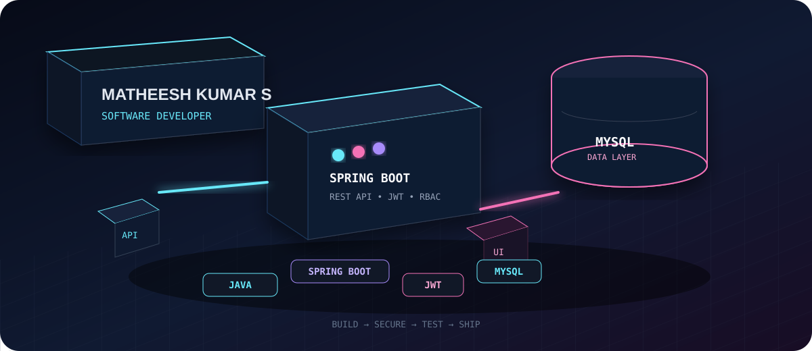

<div align="center">



<br />

### SOFTWARE DEVELOPER · JAVA · SPRING BOOT · REST APIs

**Building backend systems, APIs, and practical full-stack products.**

[](https://www.linkedin.com/in/matheeshkumar/)
[](mailto:matheeshkumar2@gmail.com)
[](https://github.com/Matheeshkumar368)
[](https://leetcode.com/u/MATHEESHKUMAR_S/)

</div>

---

## `01 / THE DEVELOPER`

<table>
<tr>
<td width="58%" valign="top">

### 👋 Hello, I'm Matheesh

I am a **Computer Science and Business Systems (CSBS) student** focused on becoming a strong **Software Developer**.

My current core is **Java + Spring Boot + REST APIs + JWT + MySQL**, with hands-on experience building role-based backend systems and academic web platforms.

I enjoy working on the complete path of a feature:

`Database → API → Authentication → Business Logic → UI`

</td>
<td width="42%" valign="top">

### CURRENT MODE

```text
BUILD     ███████████████████░  90%
LEARN     █████████████████░░░  85%
DSA       █████████████░░░░░░  65%
SYSTEMS   ███████████░░░░░░░░  55%
SHIP      ██████████████████░  90%
```

**Open to:** Entry-level Software Engineer / SDE opportunities

</td>
</tr>
</table>

> **My rule:** learn the concept → build the feature → test the API → understand the failure → improve the system.

---

## `02 / 3D ENGINEERING MAP`

<div align="center">

```text
                         ┌───────────────┐
                         │    PRODUCT    │
                         └───────┬───────┘
                                 │
                 ┌───────────────▼───────────────┐
                 │          SPRING BOOT          │
                 │       REST API + LOGIC        │
                 └───────────────┬───────────────┘
                                 │
            ┌────────────────────┼────────────────────┐
            ▼                    ▼                    ▼
        ┌────────┐          ┌─────────┐          ┌─────────┐
        │  JWT   │          │  RBAC   │          │ POSTMAN │
        └────────┘          └─────────┘          └─────────┘
                                 │
                         ┌───────▼───────┐
                         │     MYSQL     │
                         │   DATA LAYER  │
                         └───────────────┘
```

</div>

The visual above represents how I think about applications: **not as isolated code files, but as connected systems.**

---

## `03 / ENGINEERING STACK`

### Core


### Web & Tools


### Also Learning

`Python Basics` · `DSA` · `System Design`

---

## `04 / FEATURED BUILDS`

<table width="100%">
<tr>
<td width="50%" valign="top">

### 🚨 Disaster Management & Alert System

**Infosys Internship Project**

A centralized backend system designed to monitor disaster events, broadcast alerts, and coordinate rescue operations across **Admin, Responder, and Citizen** roles.

**Built with:**

`Java` `Spring Boot` `MySQL` `JWT` `REST APIs` `RBAC` `Postman`

**What I implemented**
- JWT-based role access control
- Role-restricted API endpoints
- Real-time alert notification flow
- Disaster event and status handling
- 10+ REST endpoints tested with Postman

</td>
<td width="50%" valign="top">

### 🎓 Alumni Association Platform

**Academic Project**

A web platform for alumni and institutions to connect, communicate, and network.

**Built with:**

`Java` `Spring Boot` `MySQL` `HTML` `CSS`

**What I implemented**
- User registration
- Profile creation
- Alumni search
- MySQL schema design
- Alumni records and connection requests

</td>
</tr>
</table>

---

## `05 / PROJECT SNAPSHOT`

```text
DISASTER MANAGEMENT
├── Authentication
├── Authorization
├── JWT
├── REST APIs
├── Alerts
└── Rescue coordination

ALUMNI PLATFORM
├── Registration
├── Profiles
├── Search
├── Database design
└── Connection requests
```

---

## `06 / EXPERIENCE`

### Full Stack Web Development Intern — Brainery Spot Technology

Built foundational understanding of full-stack web development and modern web technologies.

### Digital Marketing with AI Intern — Brainery Spot Technology

Worked through core concepts in SEO, social media promotion, and AI-assisted content planning.

---

## `07 / CERTIFICATIONS`

- **Java Foundation Certification** — Infosys Springboard
- **Basics of Python Certification** — Infosys Springboard

---

## `08 / EDUCATION`

**B.Tech — Computer Science and Business Systems**  
VSB Engineering College, Karur, India · **2022–2027**

**Higher Secondary Certificate — Computer Science**  
Sakthi Sai Matriculation Higher Secondary School

**SSLC**  
Sakthi Sai Matriculation Higher Secondary School

---

## `09 / 3D CONTRIBUTION WALL`

<div align="center">


</div>

> This section is generated automatically by GitHub Actions and turns the contribution history into a 3D isometric wall.

---

## `10 / CURRENT MISSION`

> **Become the kind of developer who understands why a system works — not just how to make it run.**

Right now I am strengthening:

`Java Fundamentals → OOP → DSA → REST APIs → Spring Boot → Security → SQL → System Design`

---

## `11 / GITHUB SIGNAL`

<div align="center">


</div>

---

## `12 / LET'S CONNECT`

<div align="center">

### Building. Learning. Shipping. Repeating.

[**LinkedIn**](https://www.linkedin.com/in/matheeshkumar/) · [**Portfolio**](https://matteeshu-3d-journey.lovable.app) · [**Email**](mailto:matheeshkumar2@gmail.com) · [**LeetCode**](https://leetcode.com/u/MATHEESHKUMAR_S/) · [**Resume**](https://drive.google.com/file/d/1e0Dje1_0K1RYToh2VpitkpMHKxf4TNeD/view?usp=sharing)

</div>

---

<div align="center">

**Thanks for stopping by. ⚡**

</div>
